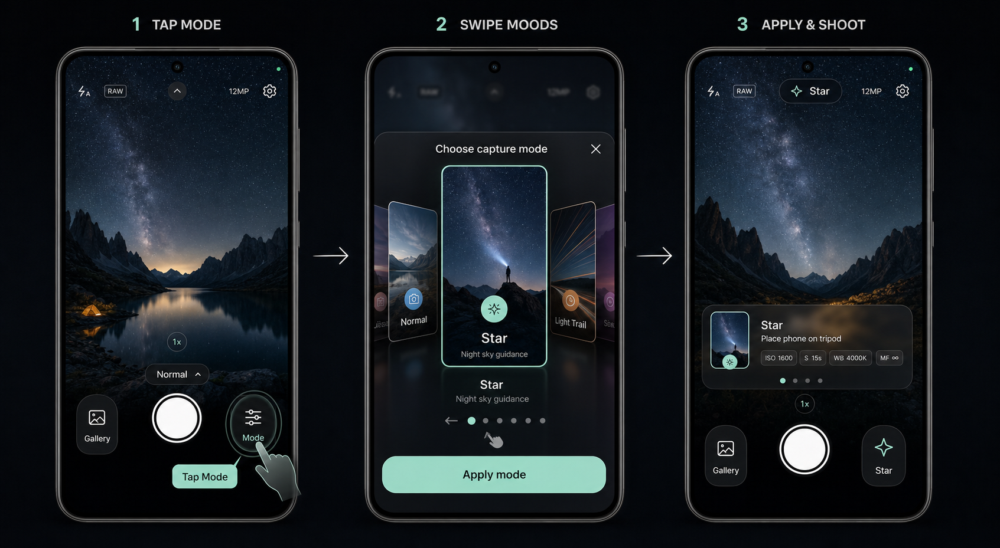

# Proposal: Camera Mode Selection Redesign

Status: Implemented; physical-device acceptance testing remains
Created: 2026-08-31
Implemented before: 2026-09-16
Reference image: [`../assets/camera-mode-selection-reference.png`](../assets/camera-mode-selection-reference.png)



## Decision clarified

The approved target is the **middle screen labelled “2 SWIPE MOODS”** in the
reference image.

This means the camera mode selector must be a photographic, perspective-based
3D cover-flow experience:

- One tall selected mode card is centered, front-facing, and dominant.
- The previous and next mode cards remain partially visible.
- Neighboring cards rotate away in 3D and recede behind the selected card.
- Swiping moves the cards continuously with the user's finger and snaps one
  mode into the center.
- The selected mode is committed only after the user presses **Apply mode**.

The implementation follows this target rather than the earlier abstract
icon-card layout or a flat horizontal list with simple scaling.

## Implementation result

`components/capture-mode-carousel.tsx` now implements photographic cards,
cover-flow depth, horizontal dragging and snapping, draft selection, Apply,
dismissal without applying, accessibility actions, and reduced-motion
behavior. `constants/capture-modes.ts` owns stable local artwork references and
presentation copy.

The completed mapping is:

| Approved middle screen | Implemented behavior |
| --- | --- |
| Photographic mood artwork fills each card | Bundled local artwork rendered with `expo-image` |
| Tall portrait card proportions | Responsive portrait card with capped dimensions |
| Strong cover-flow depth and overlap | Perspective, translation, scale, opacity, and stacking order are derived from the shared position |
| Adjacent cards angle behind the center | Neighbor cards rotate and recede on both sides |
| Camera preview remains visible behind a dark overlay | Animated translucent scrim and bottom sheet preserve camera context |
| Mode identity lives on the card | Icon, name, and description are anchored over a fixed image shade |
| Minimal controls | Close, swipe stage, details, dots, hint, and Apply |

Remaining work is hands-on release-build tuning and accessibility verification,
not another selector rewrite.

## Scope

This proposal covers only the camera mode-selection interface and its selection
state.

It includes:

- Opening the selector from the right-side Mode control.
- Browsing Auto, Star, Light Trail, Waterfall, Portrait, 美顔, and Product.
- Drafting a selection without immediately changing the active camera mode.
- Applying or dismissing the draft selection.
- Updating the camera UI after Apply.
- Responsive, accessible, and reduced-motion behaviour.

It does not include:

- Implementing ISO, shutter, RAW, focus, stacking, HDR, or other capture logic.
- Changing the adaptive capture proposal.
- Changing camera permissions, saving, gallery, zoom, or settings.
- Adding new capture modes.
- Applying a mode merely because its card passed through the center.

## Intended interaction

### 1. Open

The user taps the right-side Mode control on the camera screen.

- The camera preview remains mounted.
- A dark translucent scrim reduces preview distraction.
- A rounded panel rises from the bottom.
- The currently applied mode is initially centered.
- The sheet title reads **Choose capture mode** and includes a 44×44 minimum
  close target.

The initial opening should not change the current mode.

### 2. Browse

The user drags horizontally across the card stage.

- Cards track the finger on the UI thread.
- The selected candidate card moves to the foreground.
- Cards on the left rotate toward the left and recede.
- Cards on the right rotate toward the right and recede.
- The nearest neighboring cards remain recognizable and tappable.
- A light selection haptic fires once when a different card settles into the
  center, not continuously during scrolling.
- Tapping a neighboring card moves it to the center.

The camera's active mode still does not change while browsing.

### 3. Review

The centered card shows:

- Mode-specific photographic artwork.
- Mode icon in a circular accent badge.
- Mode name.
- One concise outcome-oriented description.

Below the card stage:

- Repeat the selected mode name and short guidance only if needed for
  readability on smaller artwork.
- Show seven pagination dots with the active position visible through shape and
  color, not color alone.
- Show a subtle swipe affordance for first-time discoverability.

Technical values must not be shown as applied camera settings. Preset values
remain suggestions until the adaptive capture engine actually applies them.

### 4. Apply

The user presses **Apply mode**.

- Commit the centered draft mode.
- Fire one success/commit haptic.
- Close the selector.
- Update the right-side Mode control to the selected mode name/icon.
- Show the existing compact mode guidance on the camera screen for smart
  presets.
- Auto mode returns to the standard automatic camera UI.

### 5. Dismiss

Close button, Android Back, or tapping the permitted scrim area dismisses the
selector without applying the draft selection.

Reopening the selector centers the last applied mode, not the last dismissed
draft.

## Visual specification

### Overall presentation

- Dark cinematic camera aesthetic consistent with IntelliCam.
- Camera preview remains contextually visible behind a dark scrim.
- Avoid animating live blur intensity. On Android, prefer a static translucent
  scrim rather than adding a costly real-time blur over the camera surface.
- Sheet surface: near-black graphite with a subtle border and continuous
  rounded top corners.
- One primary action only: **Apply mode**.

### Card composition

Each mode card uses a stable, bundled photographic image rather than a
generated gradient or abstract icon background. The current Portrait and
Beauty cards share the portrait artwork; a dedicated Beauty asset remains an
optional visual refinement.

Proposed image direction:

| Mode | Artwork direction |
| --- | --- |
| Auto | Balanced everyday landscape or street scene with natural exposure |
| Star | Milky Way or clear star field over a dark landscape |
| Light Trail | Vehicle light trails through a city or road |
| Waterfall | Silky waterfall with visible surrounding detail |
| Portrait | Naturally lit person with clear subject separation |
| Beauty | Soft, naturally lit face with realistic skin texture |
| Product | Refined studio product photograph with controlled highlights |

All six images should share:

- Portrait composition suitable for a tall card.
- Dark enough lower region for readable white labels.
- No embedded text, logos, or watermarks.
- Consistent photographic quality and color grading.
- Local bundled delivery so the selector works offline and never shifts while
  loading.

The center card should have:

- Tall portrait proportions close to the reference.
- A thin mode-colored outline.
- Strongest opacity and contrast.
- A circular icon badge near the lower image area.
- Mode name and description anchored consistently.

Adjacent cards should have:

- Partial visibility at both sides.
- Reduced scale and opacity.
- Perspective rotation away from the center.
- Slight inward translation so they visually sit behind the active card.
- Lower stacking order than the selected card.

Only the nearest one or two cards on either side need to remain visible.

### Color and typography

- Preserve the near-black IntelliCam palette.
- Preserve the existing mode accent colors for outlines, badges, dots, and the
  Apply button.
- Use white for primary labels and an accessible muted gray for supporting
  copy.
- Text must remain readable over every card image through a fixed bottom
  gradient/scrim, not by relying on image darkness alone.
- Minimum text size: 12sp for compact supporting copy and 16sp for meaningful
  mode labels.

### Touch targets

- Close and Apply controls: at least 44×44pt / 48dp.
- Neighboring cards remain tappable without overlapping the system back-gesture
  edge.
- Keep at least 8dp separation between distinct compact controls.
- Horizontal swiping must be limited to the carousel stage and must not capture
  vertical sheet-dismiss or system navigation gestures unintentionally.

## Layout behaviour

### Standard phones

- Sheet occupies roughly the lower 75–88% of the viewport.
- Center card is the visual focus and fits without clipping.
- Apply remains above the bottom safe area.

### Short phones

Do not flatten the card into the current short horizontal design.

Instead:

- Preserve the portrait card ratio.
- Reduce card height proportionally.
- Reduce vertical gaps and optional secondary guidance.
- Keep close, dots, and Apply accessible.
- Allow the photographic card stage to take priority over duplicate text.

### Tablets and wide screens

- Cap the sheet and card-stage width.
- Do not stretch the center card.
- Increase side-card visibility rather than increasing card width excessively.

## Motion specification

Purpose: **spatial consistency and state indication**.

The carousel is finger-driven, so motion should use Reanimated shared values
and UI-thread animated styles. It must not call React state setters for every
scroll frame.

### Continuous card transforms

For each card, derive a normalized distance from the center position and
interpolate only transform and opacity:

- `translateX`: pulls neighboring cards inward behind the active card.
- `translateY`: lowers receding cards slightly.
- `scale`: 1.0 at center, approximately 0.76–0.82 for immediate neighbors.
- `rotateY`: 0° at center, approximately ±24–32° for immediate neighbors.
- `opacity`: 1.0 at center, approximately 0.48–0.65 for immediate neighbors.
- `perspective`: fixed value sufficient to make rotation visible without
  distortion.

Final values must be tuned on a physical Android device against the preserved
reference image. They are acceptance targets, not arbitrary constants to copy
without visual testing.

### Snap behaviour

- The drag must remain interruptible.
- On release, settle to the nearest card using a spring that carries gesture
  velocity.
- Recommended starting spring: duration 400ms, damping ratio 0.8, using release
  velocity.
- Avoid bounce unless momentum caused it.
- Apply one selection haptic when the snap commits to a new index.

### Sheet motion

- Enter with a bottom-sheet spring around 300ms perceived duration.
- Exit faster than entry.
- The scrim fades separately using opacity.
- Do not animate blur intensity, height, width, or layout properties per frame.

### Reduced motion

When system Reduce Motion is enabled:

- Remove perspective rotation, depth translation, and overshoot.
- Keep horizontal snapping, opacity, selection outline, and dots.
- Use a gentle fade/scale state change so selection remains understandable.

## Implemented data model

The current mode option model contains a stable local image source:

```ts
interface CaptureModeOption {
  id: string;
  name: string;
  description: string;
  icon: IconName;
  tint: string;
  tip: string;
  artwork: number;
}
```

Keep the mode definition separate from rendered card dimensions and animation
values.

Maintain two pieces of selection state:

- `appliedModeId`: the mode currently active on the camera screen.
- `draftModeId` or `draftIndex`: the centered card while the selector is open.

Only Apply copies the draft selection into the applied selection.

## Implemented structure

Primary implementation files:

- `components/capture-mode-carousel.tsx`
  - Renders the photographic overlapping cover-flow stage.
  - Owns draft selection, snapping, reduced motion, and accessibility actions.
- `constants/capture-modes.ts`
  - Holds stable artwork references and presentation copy.
- `app/index.tsx`
  - Owns the applied mode and open/close/apply integration.
- `assets/images/capture-modes/`
  - Contains the bundled local card images.

The preserved design reference remains documentation-only:

- `docs/assets/camera-mode-selection-reference.png`

## Accessibility requirements

- Carousel exposes `accessibilityRole="adjustable"`.
- Screen-reader label announces the currently centered draft mode.
- Increment and decrement accessibility actions move exactly one mode.
- Apply announces the mode that will be committed.
- Close is explicitly labelled and restores focus to the Mode trigger where
  supported.
- Visual state is not conveyed through tint alone; selected card also changes
  scale, position, outline, and dot shape.
- Test with Android TalkBack and increased font size.
- Decorative card imagery is hidden from the accessibility tree when the card
  label already communicates the mode.

## Performance requirements

- Keep continuous motion on the UI thread.
- Animate transforms and opacity only.
- Use `expo-image` for local artwork decoding and caching.
- Preload the six bundled card assets when the camera screen becomes ready or
  before the sheet finishes opening.
- Do not perform image generation, network requests, or heavy computation while
  the selector is opening.
- Do not animate Android elevation or live blur.
- Verify on a physical release build, not only Metro development mode.

## Implementation record

1. [x] Add bundled photographic card assets and presentation data.
2. [x] Separate applied mode from the centered draft selection.
3. [x] Build the overlapping card stage and UI-thread perspective transforms.
4. [x] Add snapping, tapping, haptics, dots, Apply, dismissal, and reopen state.
5. [x] Add reduced-motion and screen-reader increment/decrement alternatives.
6. [ ] Verify Android Back, TalkBack, large text, interrupted drags, and focus
   restoration on physical devices.
7. [ ] Tune release-build motion and spacing against the preserved reference.

## Acceptance criteria

The redesign is complete only when all of the following are true:

- The middle “SWIPE MOODS” panel is visibly recognizable as the implemented
  design without explanation.
- Cards use photographic mood artwork, not abstract icon artwork.
- One tall center card dominates while angled side cards visibly recede behind
  it.
- The carousel continuously follows the user's drag and snaps predictably.
- Auto plus all six smart modes are present in the correct order.
- Browsing does not apply a mode.
- Apply commits exactly the centered mode and closes the selector.
- Dismissal preserves the previously applied mode.
- Reopening centers the applied mode.
- Touch targets, safe areas, Android Back, TalkBack actions, and reduced motion
  work correctly.
- No capture functions or preset camera behaviour are added as part of this UI
  change.
- TypeScript and Expo lint pass.
- The interaction remains smooth on a physical Android release build.

## Completion status

The production implementation exists. Do not schedule another carousel rewrite
from this proposal. Complete the remaining physical-device and accessibility
acceptance checks, then record any narrowly scoped tuning changes.

